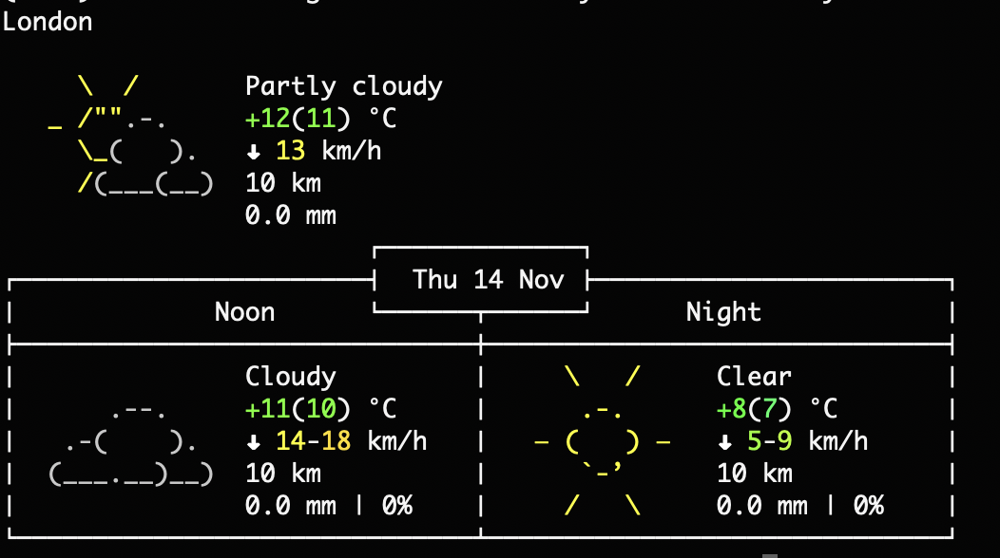

# winzy-weather

[](https://pypi.org/project/winzy-weather/)
[](https://github.com/sukhbinder/winzy-weather/releases)
[](https://github.com/sukhbinder/winzy-weather/actions?query=workflow%3ATest)
[](https://github.com/sukhbinder/winzy-weather/blob/main/LICENSE)

Weather using the excellent [wttr.in](https://wttr.in/)

## Installation

First configure your Winzy project [to use Winzy](https://github.com/sukhbinder/winzy).

Then install this plugin in the same environment as your Winzy application.
```bash
pip install winzy-weather
```

## Usage

Usage instructions:

1. Run `winzy weather` to display the current weather.
2. To specify a city, use the `-c` or `--city` option followed by the city name. For example: `winzy weather -c London`.
3. To print in wide format, use the `-w` or `--wide` option.
4. To show the forecast without displaying the daily forecast, use the `-nf` or `--no-forecast` option.
5. To display today's forecast, use the `-t` or `--today` option.

```bash
winzy weather -c London -t
```



## Development

To set up this plugin locally, first checkout the code. Then create a new virtual environment:
```bash
cd winzy-weather
python -m venv venv
source venv/bin/activate
```
Now install the dependencies and test dependencies:
```bash
pip install -e '.[test]'
```
To run the tests:
```bash
python -m pytest
```
